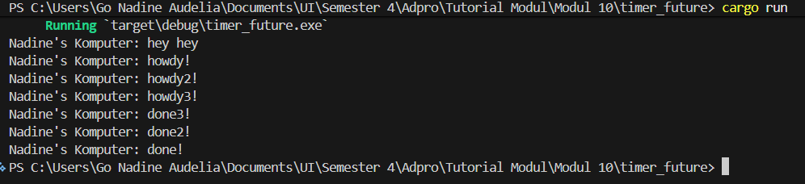
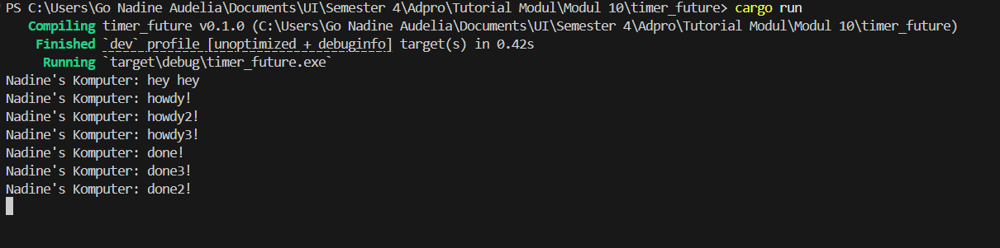

## REFLEKSI 1.2 ##

Alasan utama mengapa "Nadine's Komputer: hey hey" tercetak lebih dulu adalah karena sifat eksekusi kode di dalam blok spawner.spawn yang berjalan secara asynchronous. Pemanggilan fungsi spawn hanya bertugas untuk membungkus instruksi tersebut dan memasukkannya ke dalam antrean milik executor. Karena proses pendaftaran ke antrean ini bersifat non-blocking, maka alur program utama akan langsung berjalan terus ke baris berikutnya dan langsung mengeksekusi perintah sinkronus println!("Nadine's Komputer: hey hey");. Task asynchronous yang bertugas mencetak teks "Nadine's Komputer: howdy!" baru benar-benar mulai dikerjakan ketika program mencapai baris pemanggilan fungsi executor.run() di bagian paling akhir. Meskipun blok spawn dideklarasikan di atas namun hasilnya akan selalu dieksekusi belakangan setelah main thread selesai memproses kode-kode di bawahnya.

## REFLEKSI 1.3 ##

Gambar untuk kode yang ada drop spawn

Gambar untuk kode yang tidak ada drop spawn

Penjelasan:
Melakukan multiple spawn berarti memasukkan beberapa task asinkron sekaligus ke dalam antrean eksekusi sehingga executor dapat menjalankan tugas-tugas secara konkuren. Hal ini terlihat jelas saat program berjalan dimana executor tidak menganggur saat sebuah task menemui jeda waktu, melainkan langsung berpindah memproses task lainnya sehingga seluruh teks "howdy!" dicetak secara berurutan, lalu menunggu jeda secara paralel, dan diakhiri dengan mencetak "done!" secara bersamaan. Dalam mekanisme ini, spawner bertindak sebagai pihak pengirim yang mendaftarkan task ke dalam saluran antrean, sedangkan executor bertindak sebagai penerima sekaligus mesin pekerja yang mengambil dan mengeksekusi antrean. Fungsi drop spawner sangat krusial karena bertugas untuk menutup saluran pengiriman yang berfungsi sebagai sinyal kepada executor bahwa tidak ada lagi task baru yang akan masuk. Jika fungsi drop ini dihapus, saluran komunikasi akan terus terbuka sehingga executor terjebak dalam perulangan tanpa batas untuk mendengarkan task baru yang tidak akan pernah datang yang pada akhirnya menyebabkan program mengalami hang di terminal. 